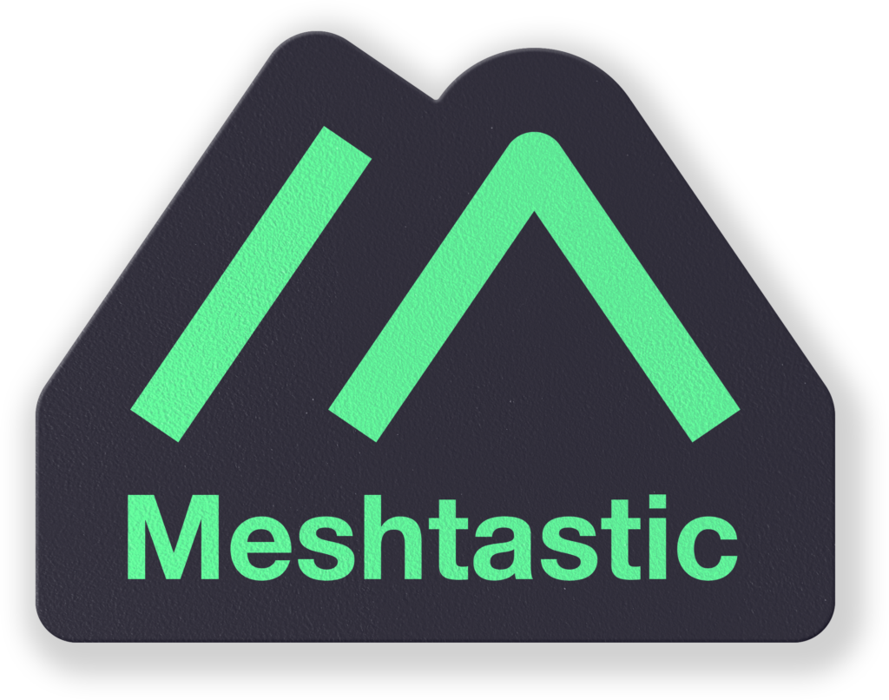

<p align="center"></p>
<h1 align="center"> ESP32 Meshtastic </h1> 
<h4 align="right">Oct 26</h4>

<p>
  
</p>

<br>

# Table of contents
- [Table of contents](#table-of-contents)
- [Heltec ESP32 LoRa V3 | Tutorial de Meshtastic](#heltec-esp32-lora-v3--tutorial-de-meshtastic)
  - [1. ¿Qué es el Heltec WiFi LoRa 32 V3?](#1-qué-es-el-heltec-wifi-lora-32-v3)
    - [Pines I2C relevantes (ya definidos en el firmware de Meshtastic)](#pines-i2c-relevantes-ya-definidos-en-el-firmware-de-meshtastic)
  - [2. Qué es Meshtastic](#2-qué-es-meshtastic)
  - [3. Meshtastic vs. LoRa vs. LoRaWAN: ¿cómo se comparan?](#3-meshtastic-vs-lora-vs-lorawan-cómo-se-comparan)
    - [Ventajas y desventajas](#ventajas-y-desventajas)
    - [¿Cuándo usar cada uno?](#cuándo-usar-cada-uno)
  - [4. Qué vas a necesitar](#4-qué-vas-a-necesitar)
  - [5. Firmware de Meshtastic](#5-firmware-de-meshtastic)
    - [Pasos para flashear](#pasos-para-flashear)
  - [6. App de Meshtastic (para configurar y usar el nodo)](#6-app-de-meshtastic-para-configurar-y-usar-el-nodo)
    - [Primer emparejamiento](#primer-emparejamiento)
  - [7. Resolución de problemas comunes](#7-resolución-de-problemas-comunes)
  - [8. Referencias](#8-referencias)
- [ESP32\_Meshtastic](#esp32_meshtastic)

<br>

# Heltec ESP32 LoRa V3 | Tutorial de Meshtastic

> Guía para poner en marcha un nodo Meshtastic sobre el Heltec WiFi LoRa 32 (V3).

## 1. ¿Qué es el Heltec WiFi LoRa 32 V3?

Es una placa de desarrollo todo-en-uno basada en:

- **MCU:** ESP32-S3FN8 (Wi-Fi + Bluetooth, dual-core)
- **Transceptor LoRa:** Semtech SX1262
- **Pantalla:** OLED 0.96"
- **Gestión de batería:** cargador de Li-Ion integrado
- **Bandas soportadas:** 433 MHz, 470–510 MHz, 863–870 MHz, 902–928 MHz (hay que elegir la variante que corresponda a tu región)

Es, según la propia documentación de Meshtastic, una de las placas más usadas por la comunidad para armar nodos — buena relación costo/funcionalidad y soporte de fábrica en el proyecto.

> ⚠️ **Nota de hardware:** si vas a cargar la batería mientras está conectada por USB-C, usá un cable **USB-A a USB-C**. Con cables USB-C a USB-C hay reportes de problemas de carga, y el puerto USB-C de esta placa no tiene protección ESD.

### Pines I2C relevantes (ya definidos en el firmware de Meshtastic)
| Función | GPIO |
|---|---|
| SDA | GPIO41 |
| SCL | GPIO42 |

No necesitás tocar estos pines para el uso estándar — el firmware de Meshtastic ya trae el *board definition* `heltec-v3` con esta configuración.

---

## 2. Qué es Meshtastic

[Meshtastic](https://meshtastic.org/) es un proyecto de firmware y apps open-source para armar **redes mesh LoRa** de largo alcance, sin infraestructura (sin internet, sin celular, sin repetidoras pagas). Cada nodo (como tu Heltec V3) retransmite mensajes de texto, posición GPS y telemetría a otros nodos dentro del rango de radio, extendiendo la cobertura salto a salto.

Usos típicos: comunicación off-grid en senderismo/montaña, emergencias, eventos masivos, IoT de bajo consumo, redes comunitarias.

---

## 3. Meshtastic vs. LoRa vs. LoRaWAN: ¿cómo se comparan?

Antes de la comparación hay una aclaración necesaria: **no son tres alternativas al mismo nivel**. LoRa es la **capa física de radio** (la modulación chirp spread spectrum que usa el chip SX1262 de tu Heltec V3). Sobre esa misma radio se pueden construir distintos **protocolos de red**, y los dos más conocidos son justamente Meshtastic y LoRaWAN — cada uno resuelve el "¿cómo se organizan los nodos y a dónde van los datos?" de forma muy distinta.

- **LoRa** → la radio (el "cable invisible").
- **LoRaWAN** → protocolo estandarizado (LoRa Alliance) pensado para IoT: topología **estrella-de-estrellas**, con **gateways** que suben todo a un **Network Server** y de ahí a un **Application Server** (típicamente en la nube, como The Things Network/TTN, ChirpStack o un proveedor comercial).
- **Meshtastic** → protocolo **mesh** descentralizado, sin gateways ni servidor central: cada nodo es a la vez cliente y repetidor, y la red vive enteramente en el aire entre los dispositivos.

| Aspecto | LoRa "crudo" (protocolo propio) | LoRaWAN (estándar IoT) | Meshtastic (mesh sobre LoRa) |
|---|---|---|---|
| **Qué es** | Capa física de radio, sin protocolo de red | Protocolo estandarizado de red sobre LoRa, mantenido por la LoRa Alliance | Protocolo de red mesh + firmware + apps, construido sobre LoRa |
| **Topología** | Punto a punto o estrella simple | Estrella-de-estrellas: nodos → gateway(s) → Network Server → Application Server | Mesh multi-salto: cada nodo repite el mensaje de otros, sin gateway |
| **Infraestructura necesaria** | Ninguna (o la que vos armes) | Gateway(s) + Network Server + Application Server (propio o en la nube: TTN, ChirpStack, operador comercial) | Ninguna — la red la forman los nodos mismos |
| **Alcance efectivo** | Limitado al enlace directo entre dos radios | Varios km por gateway (urbano/rural), pero todo el tráfico converge ahí | Extendido por saltos entre nodos — crece agregando más nodos, no más gateways |
| **Setup inicial** | Programás vos la lógica de envío/recepción | Configurar/contratar gateway + registrar dispositivo en un Network Server (TTN, ChirpStack, etc.) | Flashear firmware + emparejar la app, nada de infraestructura |
| **Dirección del tráfico** | La que definas | Mayormente **uplink** (nodo → nube); downlink es limitado y costoso en batería | Bidireccional entre todos los nodos (chat, mensajería) |
| **Consumo de energía** | Totalmente optimizable para tu caso | Muy bajo en el nodo (duty cycle bajo, pensado para baterías de años) | Moderado — el overhead de mesh (retransmisión, beacons) consume más que un nodo LoRaWAN típico |
| **Ancho de banda / payload** | El que definas | Payloads muy chicos (bytes), regulado por duty cycle/fair access policy | Mensajes de texto cortos, posición GPS, telemetría |
| **Latencia** | Baja y predecible (un salto) | Baja en el uplink, pero downlink es lento/limitado | Variable — depende de cuántos saltos necesite el mensaje |
| **Interoperabilidad** | Nula fuera de tu desarrollo | Alta dentro del estándar LoRaWAN (cualquier gateway/nodo compatible con TTN, etc.) | Alta entre nodos Meshtastic de cualquier fabricante, sin servidor central |
| **Dependencia de terceros** | Ninguna | Sí — necesitás un Network Server (propio o de un proveedor) para que la red funcione | Ninguna — funciona 100% off-grid, sin internet ni cuentas externas |
| **Curva de aprendizaje** | Alta (programar todo el firmware/protocolo) | Media (configurar gateway + Network Server + integración de datos) | Baja (flashear + app) |
| **Caso de uso típico** | Proyecto a medida, un sensor ↔ un gateway propio | Flotas de sensores IoT reportando a la nube (medidores, agricultura, smart city) | Comunicación entre personas o dispositivos sin infraestructura fija |

### Ventajas y desventajas

**LoRa crudo**
- ✅ Control total del protocolo, el payload y el consumo energético.
- ✅ Ideal para proyectos de IoT a medida (un sensor que reporta cada hora a un único gateway).
- ✅ Menor overhead de radio si el caso de uso es simple (un emisor, un receptor).
- ❌ Hay que programar todo: direccionamiento, reintentos, cifrado, descubrimiento de nodos.
- ❌ Sin mesh nativo — si necesitás multi-salto, lo tenés que implementar vos.
- ❌ No interopera con otros dispositivos salvo que compartan tu mismo protocolo custom.

**LoRaWAN**
- ✅ Estándar maduro, con ecosistema grande (TTN, ChirpStack, operadores comerciales, miles de dispositivos certificados).
- ✅ Excelente para flotas de sensores que solo necesitan subir datos a la nube con muy bajo consumo.
- ✅ Gestión centralizada: ves todos tus dispositivos desde un único Network/Application Server.
- ❌ Depende de infraestructura: necesitás al menos un gateway con conexión a internet y un Network Server.
- ❌ Downlink (nube → nodo) es limitado por el *duty cycle* y la *fair access policy* — no es para comunicación bidireccional fluida.
- ❌ Si no hay cobertura de gateway, no hay red — no se extiende sola como un mesh.
- ❌ Requiere registrar cada dispositivo (DevEUI/AppKey) en el Network Server antes de usarlo.

**Meshtastic**
- ✅ Red mesh funcionando en minutos, sin programar nada ni depender de infraestructura.
- ✅ App con mapa, chat, telemetría y cifrado end-to-end ya integrados.
- ✅ Ecosistema grande: placas de varios fabricantes, comunidad activa, firmware mantenido.
- ✅ Alcance ampliado gracias a los saltos entre nodos (más nodos = más cobertura, sin gateways).
- ✅ Funciona 100% off-grid: sin internet, sin cuentas en la nube, sin operador.
- ❌ Menos control fino sobre el protocolo de radio (estás atado a lo que Meshtastic expone).
- ❌ Mayor consumo que un nodo LoRaWAN bien optimizado (por los beacons/retransmisiones del mesh).
- ❌ No pensado para transferir datos pesados ni para integrarse "de fábrica" con plataformas de nube IoT.

### ¿Cuándo usar cada uno?

**Usá LoRa crudo (protocolo propio) cuando:**
- Necesitás un enlace punto a punto simple (un sensor remoto → un gateway fijo) sin pasar por el estándar LoRaWAN.
- El consumo energético es crítico y querés exprimir cada miliamperio con un protocolo hecho a medida.
- Tenés requisitos muy específicos que ni Meshtastic ni LoRaWAN cubren (payloads binarios particulares, timing determinístico).

**Usá LoRaWAN cuando:**
- Tenés (o vas a desplegar) **muchos sensores IoT** que solo necesitan reportar datos periódicamente a la nube (consumo de agua/gas, agricultura, monitoreo ambiental, smart city).
- Ya existe cobertura de gateways LoRaWAN en la zona (propia, de TTN, o de un operador comercial).
- Priorizás integración con plataformas IoT/nube y gestión centralizada de flotas de dispositivos sobre comunicación bidireccional en tiempo real.
- El tráfico es mayormente uplink (nodo → nube) y tolera latencia/downlink limitado.

**Usá Meshtastic cuando:**
- Querés comunicación off-grid **entre personas o dispositivos** (chat, posición) sin depender de celular, internet ni gateways.
- Necesitás cobertura mesh (multi-salto) sin desplegar infraestructura ni pagar un Network Server.
- Priorizás "plug & play": armar la red rápido, sin escribir firmware ni registrar dispositivos en ningún lado.
- El caso de uso es senderismo, eventos, emergencias, seguridad comunitaria, o un proyecto IoT simple que ya calza con lo que Meshtastic ofrece de fábrica (telemetría básica, posición, mensajería).
- Querés que tu nodo interopere directamente con los de otra gente que también usa Meshtastic, sin pasar por ningún servidor.

> En la práctica, tu Heltec V3 puede usarse para cualquiera de los tres caminos — la placa es la misma, lo que cambia es el firmware que le flasheás (Meshtastic, una pila LoRaWAN como LMIC/ChirpStack, o tu propio código LoRa). Este tutorial cubre el camino Meshtastic porque es el de menor esfuerzo para tener una red mesh funcionando sin infraestructura.

---

## 4. Qué vas a necesitar

- Placa **Heltec WiFi LoRa 32 V3** (confirmá la variante de frecuencia para tu país/región)
- Cable USB-A a USB-C (no USB-C a USB-C, ver nota arriba)
- PC con **Google Chrome** o **Microsoft Edge** (el flasher web los requiere)
- Celular (Android o iOS) con Bluetooth
- Antena LoRa correspondiente a la banda de tu placa, **conectada antes de encender el equipo** (nunca transmitas sin antena, podés dañar el transceptor SX1262)

---

## 5. Firmware de Meshtastic

El firmware oficial se descarga y se instala a través del **Web Flasher** de Meshtastic, que corre directo en el navegador usando `esptool.js` (no requiere instalar nada):

🔗 **Web Flasher oficial:** https://flasher.meshtastic.org

🔗 **Página de descargas general (firmware + apps):** https://meshtastic.org/downloads/

🔗 **Documentación oficial de flasheo para ESP32:** https://meshtastic.org/docs/getting-started/flashing-firmware/esp32/web-flasher/

🔗 **Código fuente del firmware (GitHub):** https://github.com/meshtastic/firmware

El target específico para esta placa en el flasher/compilaciones es **`heltec-v3`**, y el archivo de firmware sigue el patrón:

```
firmware-heltec-v3-X.X.X.xxxxxxx.bin
```

### Pasos para flashear

1. Conectá la placa a la PC por USB.
2. Abrí https://flasher.meshtastic.org en Chrome o Edge.
3. Seleccioná el puerto serie correspondiente a tu placa cuando el navegador lo solicite (permiso de acceso a puerto serie vía WebSerial).
4. Elegí el dispositivo **Heltec V3 / WiFi LoRa 32 V3** en la lista.
5. Seleccioná la versión de firmware (se recomienda la última **estable**, salvo que necesites una función específica de la rama *alpha*).
6. Confirmá la región de frecuencia (LoRa Region) acorde a la normativa de tu país (por ejemplo, **AU_915**, **US**, **EU_868**, **EU_433**, etc. — no todas las regiones están disponibles en todas las variantes de la placa).
7. Dale a **Flash** y esperá a que termine (no desconectes el cable durante el proceso).
8. Al finalizar, la placa reinicia y la pantalla OLED debería mostrar el logo/arranque de Meshtastic.

> El Web Flasher también incluye un **Monitor Serie** integrado, útil para ver los logs de arranque y diagnosticar problemas sin herramientas adicionales.

---

## 6. App de Meshtastic (para configurar y usar el nodo)

Una vez flasheada la placa, toda la configuración del nodo (nombre, región LoRa, canales, cifrado, GPS, etc.) y el chat se manejan desde la app oficial, conectada por Bluetooth (o USB/Wi-Fi) al dispositivo.

🔗 **Android — Google Play:** https://play.google.com/store/apps/details?id=com.geeksville.mesh

🔗 **Android — F-Droid (alternativa open-source sin Google Play):** https://f-droid.org/en/packages/com.geeksville.mesh/

🔗 **iOS / iPadOS / macOS — App Store:** https://apps.apple.com/us/app/meshtastic/id1586432531

🔗 **Cliente Web (navegador, vía Bluetooth/USB con Web Serial/Web Bluetooth):** https://client.meshtastic.org

🔗 **Código fuente Android (GitHub):** https://github.com/meshtastic/Meshtastic-Android

### Primer emparejamiento

1. Abrí la app y activá el Bluetooth del celular.
2. Buscá tu nodo en la lista (aparece con un nombre tipo `Meshtastic_XXXX`).
3. Emparejá — algunas apps/firmwares piden un PIN que se muestra en la pantalla OLED de la placa.
4. Una vez conectado, configurá:
   - **Nombre del nodo** (long name / short name)
   - **Región LoRa** (si no quedó bien seteada desde el flasher)
   - **Canal primario** (PSK de cifrado, nombre del canal)
   - **Rol del nodo** (Client, Router, etc. — para empezar, dejalo en `Client`)
5. Probá enviando un mensaje de texto por el canal primario. Si tenés otro nodo cerca, deberías verlo aparecer en la lista de nodos de la red mesh.

---

## 7. Resolución de problemas comunes

| Síntoma | Posible causa / solución |
|---|---|
| El flasher no detecta el puerto serie | Probá otro cable (muchos cables USB son solo de carga, sin líneas de datos); instalá el driver CP210x/CH9102 si Windows no reconoce el chip USB-serie |
| No carga la batería por USB-C | Usá cable USB-A a USB-C en vez de USB-C a USB-C |
| La placa no aparece en Bluetooth | Verificá que el firmware haya flasheado correctamente (revisá el Monitor Serie del Web Flasher); reiniciá el dispositivo |
| No hay alcance / no se ve otro nodo | Confirmá que la antena esté bien conectada y que ambos nodos usen la misma región LoRa y el mismo canal/PSK |
| Advertencia de "región no seteada" | Entrá a la app → Configuración del dispositivo → LoRa → seleccioná tu región antes de transmitir (por norma, varios países no permiten transmitir sin región configurada) |

---

## 8. Referencias

- [HELTEC® LoRa 32 — Meshtastic Docs](https://meshtastic.org/docs/hardware/devices/heltec-automation/lora32/)
- [HELTEC® Devices — Meshtastic Docs](https://meshtastic.org/docs/hardware/devices/heltec-automation/)
- [WiFi LoRa 32(V3) — Heltec Automation (fabricante)](https://heltec.org/project/wifi-lora-32-v3/)
- [Meshtastic Web Flasher — Documentación](https://meshtastic.org/docs/getting-started/flashing-firmware/esp32/web-flasher/)
- [Meshtastic Web Flasher — Herramienta](https://flasher.meshtastic.org/)
- [Meshtastic — Página de Descargas](https://meshtastic.org/downloads/)
- [Meshtastic Firmware — GitHub](https://github.com/meshtastic/firmware)
- [Meshtastic Android — GitHub](https://github.com/meshtastic/Meshtastic-Android)
- [Meshtastic — Google Play Store](https://play.google.com/store/apps/details?id=com.geeksville.mesh)
- [Meshtastic — F-Droid](https://f-droid.org/en/packages/com.geeksville.mesh/)
- [Meshtastic — Apple App Store](https://apps.apple.com/us/app/meshtastic/id1586432531)
- [What is LoRaWAN® Specification — LoRa Alliance](https://lora-alliance.org/about-lorawan-old/)
- [Understanding the LoRaWAN® Architecture — Semtech](https://blog.semtech.com/understanding-the-lorawan-architecture)


---

<div>
  <p>
     Copyright &nbsp;&copy; 2023 Instinto Digital <a href="https://carjavi.github.io/" title="carjavi.github">carjavi</a>
  </p>
</div>

<p align="center">
    <a href="https://instintodigital.net/" target="_blank"></a>
</p>
# ESP32_Meshtastic
ESP32_Meshtastic
